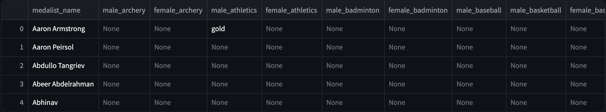
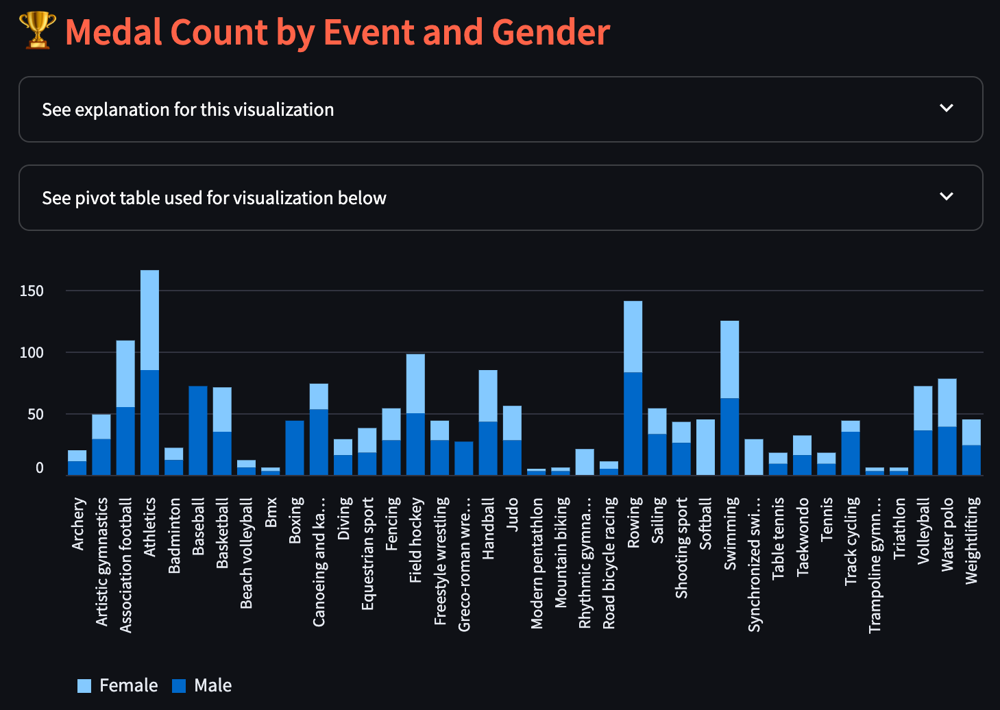
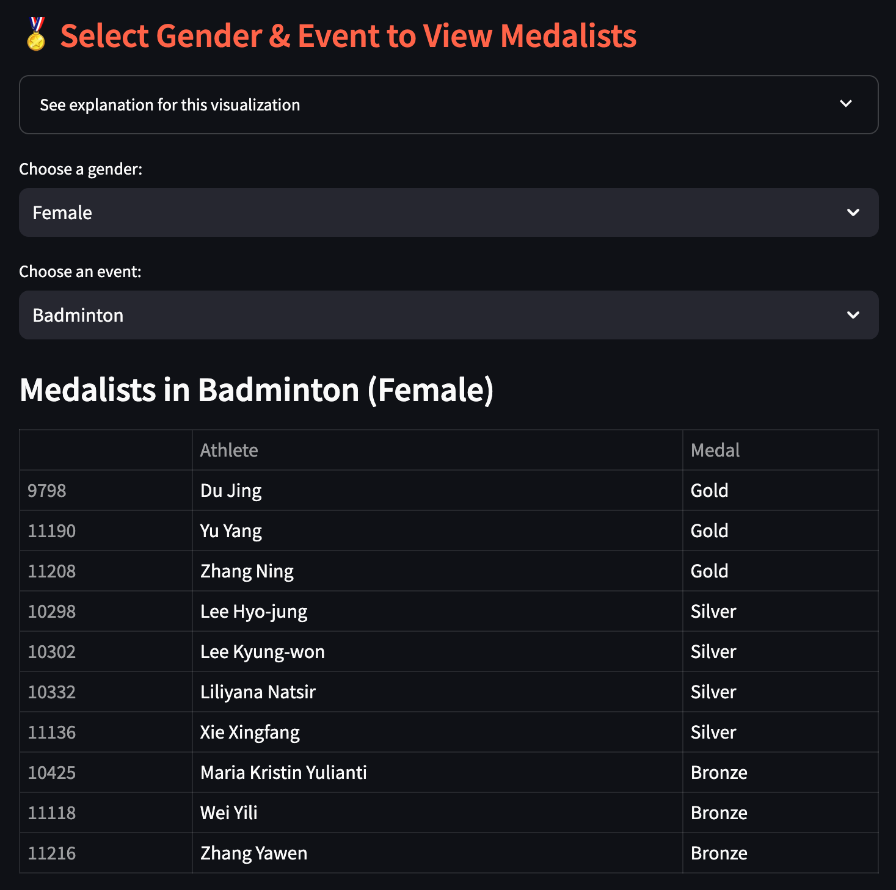

# 🏅 2008 Olympic Medalists - Tidy Data Project

## 📌 Project Overview
This project focuses on cleaning and visualizing the 2008 Olympic medalist dataset using **tidy data principles**. The raw dataset contains unstructured information, requiring transformations to make it easier to analyze.

### **What is Tidy Data?**
Tidy data follows three key principles:
1. **Each variable** forms its own **column**.
2. **Each observation** forms its own **row**.
3. **Each value** belongs to its respective **cell**.

By applying these principles, we transform messy data into a structured format suitable for analysis and visualization.

---

## 🚀 How to Run This Project
### **1️⃣ Install Dependencies**
Ensure you have **Python 3.7+** and the required packages installed. You can install them using:
```sh
pip install streamlit pandas
```
### **2️⃣ Run the Streamlit App**
Clone the repository and navigate to the project folder. Then, run the following command:
```sh
streamlit run tidy_data_analysis.py
```
---
## 📊 Dataset Description
**Dataset**: `olympics_08_medalists.csv`

### Source & Description
- Contains medalist information from the 2008 Summer Olympics.
- Includes details such as athlete names, events, gender, and medals won.

### Pre-processing Steps:
- ✅ Used `melt()` to restructure data.
- ✅ Split event names to extract gender and event details.
- ✅ Capitalized entries for consistency.
- ✅ Dropped duplicates and missing values.
- ✅ Created pivot tables for medal counts by event and gender.

---

## 🔍 Key Features
- ✔ Raw & cleaned data previews 📄
- ✔ Pivot table for medal counts 🏆
- ✔ Interactive athlete selection 👤
- ✔ Dropdowns for filtering medalists 🎖
- ✔ Styled sections for better readability 🎨

---

## 📸 Visual Examples
Below are some screenshots of the app in action. I first have the raw data displayed.
Then I have the visualizations I created after cleaning the data.
## Raw Data


## Bar Chart Visualization


## Table Visualization



## 📚 References
- [**Tidy Data Principles**](https://vita.had.co.nz/papers/tidy-data.pdf) by Hadley Wickham
- [**Pandas Cheat Sheet**](https://www.datacamp.com/cheat-sheet/pandas-cheat-sheet-for-data-science-in-python)

